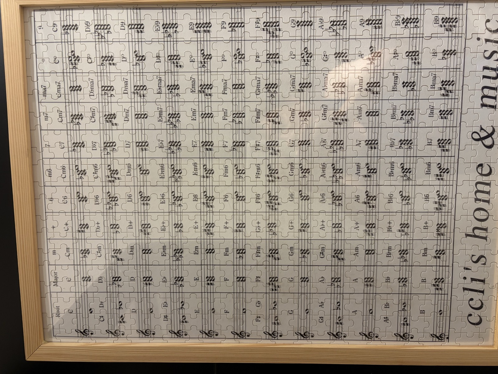

# Harmony Wiki（和聲樂理）

> Last updated: 2026-06-16 | Concepts: 10 | Chord References: 13 | Total: 24 pages
> 並列 wiki：[../wiki_piano/index](../wiki_piano/index.md) (鋼琴指法) + [../wiki_phrase/index](../wiki_phrase/index.md) (樂句分段) + [../wiki_articulation/index](../wiki_articulation/index.md) (觸鍵詮釋)

## 學習路線圖

```
音程 → 三和弦 → 七和弦 → 延伸和弦
               ↘ sus/add 色彩和弦
               ↘ 功能和聲 → 終止式 → 和弦進行 → 離調 → 轉調
```

1. [concept_interval](concept_interval.md) — **音程基礎**：半音距離、音程品質（完全/大/小/增/減）、協和與不協和
2. [concept_triad](concept_triad.md) — **三和弦**：大/小/減/增四種品質、根音位/第一轉位/第二轉位
3. [concept_seventh_chord](concept_seventh_chord.md) — **七和弦**：五種常見七和弦型、轉位記法、功能用途
4. [concept_extended_chord](concept_extended_chord.md) — **延伸和弦（九/十一/十三）**：疊加三度、爵士聲部省略規則
5. [concept_sus_add_chord](concept_sus_add_chord.md) — **Sus 與 Add 色彩和弦**：sus2/sus4、add9/add11、與延伸和弦的區別
6. [concept_chord_function](concept_chord_function.md) — **功能和聲（T/S/D）**：主功能/下屬功能/屬功能、大調小調中的對應級數
7. [concept_cadence](concept_cadence.md) — **終止式**：正格/變格/半/偽終止、強弱與位置效果
8. [concept_progression](concept_progression.md) — **和弦進行**：常見進行模式（I-IV-V-I、ii-V-I、I-V-vi-IV）、根音動向規律
9. [concept_secondary_dominant](concept_secondary_dominant.md) — **副屬和弦（離調）**：V/V、V/ii 等借用、短暫離調 vs 真正轉調
10. [concept_modulation](concept_modulation.md) — **轉調**：近系/遠系、樞紐和弦法、等音轉調、段落級 vs 局部轉調

## 和弦速查索引

### 三和弦（Triads）

- [chord_major](chord_major.md) — 大三和弦：根音 + 大三度 + 完全五度
- [chord_minor](chord_minor.md) — 小三和弦：根音 + 小三度 + 完全五度
- [chord_diminished](chord_diminished.md) — 減三和弦：根音 + 小三度 + 減五度
- [chord_augmented](chord_augmented.md) — 增三和弦：根音 + 大三度 + 增五度

### 七和弦（Seventh Chords）

- [chord_dominant7](chord_dominant7.md) — 屬七和弦（Mm7）：最強的解決驅動力
- [chord_major7](chord_major7.md) — 大七和弦（MM7）：色彩柔和、爵士/流行常用
- [chord_minor7](chord_minor7.md) — 小七和弦（mm7）：ii 級基礎、ii-V-I 核心
- [chord_dim7](chord_dim7.md) — 減七和弦（dd7）：全減、對稱結構、等音轉調工具
- [chord_half_dim7](chord_half_dim7.md) — 半減七和弦（dm7）：小調 ii° 7、導七和弦替代

### 延伸與色彩和弦（Extended & Color Chords）

- [chord_9th](chord_9th.md) — 九和弦：屬九/大九/小九、聲部省略規則
- [chord_sus](chord_sus.md) — Sus 和弦：sus2/sus4、解決傾向與懸留效果
- [chord_add](chord_add.md) — Add 和弦：add9/add11/add13、不含中間延伸音
- [chord_6th](chord_6th.md) — 六和弦：大六/小六、與九和弦的等音關係

## 和弦總表拼圖



和弦對照圖（拼圖形式）：收錄各調大/小/屬七等常用和弦的根音排列與轉位，可作為速查參考。

## 相關資源

鋼琴彈奏對應（見 wiki_piano）：

- [和弦指法](../wiki_piano/concept_chord_fingering.md) — 三和弦各轉位標準指法、音域適應、左手例外規則
- [和弦聲部突顯指法](../wiki_piano/concept_chord_voicing_fingering.md) — top-voice / bass-voice / inner-voice 強指偏好
- [標準音階琶音指法](../wiki_piano/concept_standard_scale_arpeggio_fingering.md) — 音階/琶音與和聲結構的連結
